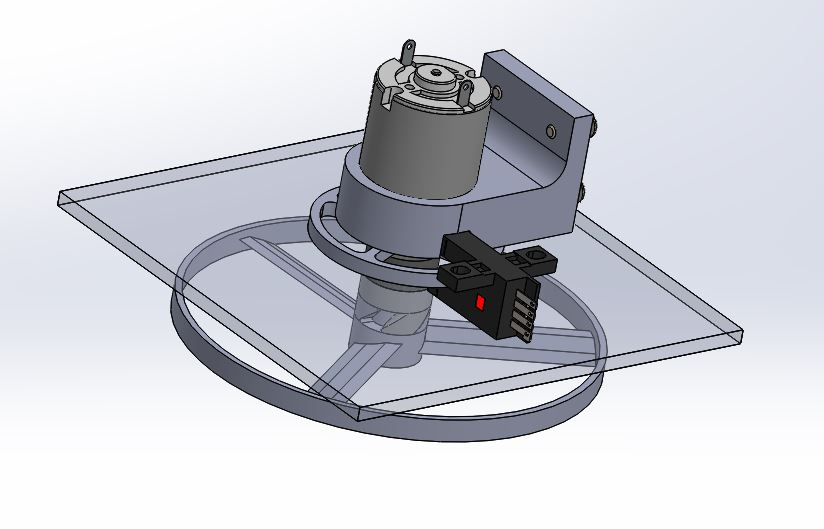
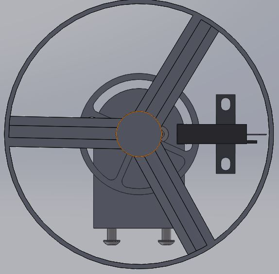
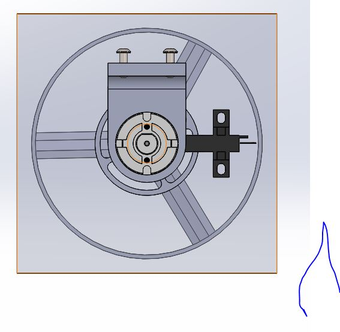
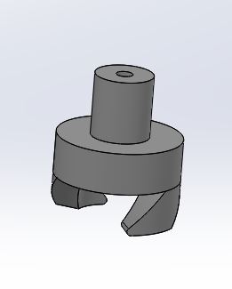
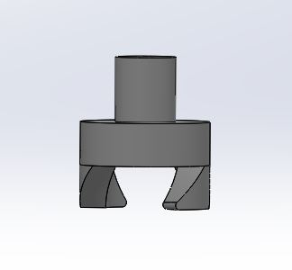
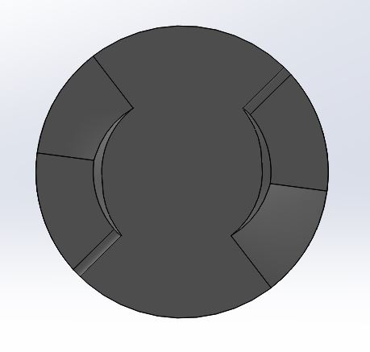

# RobotArm2019-2020

## Links/Resources/Help

Our inspiration for this project came from these toys. 

## Planning

### Items Needed
### Schedule
| Date          | Goals         |
| ------------- | ------------- |
| Week 1 : January 13 - 17   | Finish basic planning Get Github repo set up|
|Week 2 : January 22 - 24    | Start designing the launcher mechanism in Solidworks and Write code for potentiometers and servos|

## Code

The Code is under this GitHub Link: 

https://github.com/glenert41/RobotArm2019-2020/blob/master/Robot_Arm.py

## Solidworks
This section contains pictures of our last versions of our SolidWorks assemblies and parts. A large quantity of these are not complete, for obvious reasons. 

## Images

## Reflections

