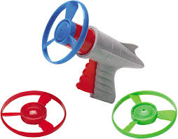

# RobotArm2019-2020
Everyone Come to the Buford Stem Night Please - Jude Emile Fairchild

These young men had dedicated a lot of time to it!

## Links/Resources/Help

Our inspiration for this project came from these toys. 

## Planning

## Code

The Code is under this GitHub Link: 

## Solidworks
This section contains pictures of our last versions of our SolidWorks assemblies and parts. A large quantity of these are not complete, for obvious reasons. 

## Images

## Reflections

