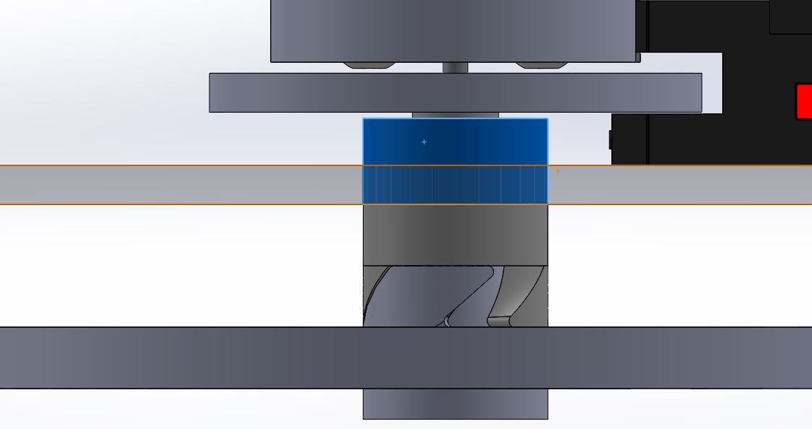

# RobotArm2019-2020

## Links/Resources/Help

Our inspiration for this project came from these toys. 

Here's a link to part of a video which shows the spinny motion that we are trying to replicate. It shows the lock mechanism for the propeller along with how it will launch. https://youtu.be/Gp0Zi7U--30?t=315 

## Planning

### Items Needed

| Item          | Quantity      |
| ------------- |:-------------:|
| Metro board | 1 |
| Breadboard | 1 | 
| Potentiometers | 3 |
| LCD screen | 1 |
| LCD backpack | 1 |
| Large button | 1 |
| Photointerrupter | 1 |
| Large motor | 1 |
| Large black servo | 1 |
| Small blue servos | 2 |
| Assorted #4-40 screws | n/a |
| Assorted wires | n/a |

### Schedule
| Date          | Goals         |
| ------------- | ------------- |
| Week 1 : January 13 - 17   | Finish basic planning Get Github repo set up|
|Week 2 : January 22 - 24    | Start designing the launcher mechanism in Solidworks and Write code for potentiometers and servos|
|Week 3 : January 27 - 31 | Finish the launcher mechanism, start designing the z-axis servo mechanism and x/y servo system. Also Write code to control DC motor/launcher mechanism|
| Week 4 : February 3 - 7 | Once launcher mechanism is done, print out all the pieces and start testing Display info on LCD according to pot values|
| Week 6 : February 17 - 21 | Start work on servo arm in Solidworks and Continue working on code|
| Week 7 : February 24 - 28 | Finish servo arm in Solidworks, start working on base of arm. Also, Finish and polish code |
| Week 8 : March 2 - 6 | Finish any last Solidworks parts & assemblies |
| Week 9 : March 9 - 13 | Print & cut out all Solidworks pieces and assemble |
| Week 10 : March 16 - 20 | Make adjustments to any faulty pieces and redo|
| Week 11 : March 23 - 27 | Have full robot arm and launcher mechanism working with code |
| Week 12 : March 30 - April 3 | Make any final adjustments |

## Code

The Code is under this GitHub Link: 

https://github.com/glenert41/RobotArm2019-2020/blob/master/Robot_Arm.py

## Solidworks
This section contains pictures of our last versions of our SolidWorks assemblies and parts. A large quantity of these are not complete, for obvious reasons. 

The pictures above and below are pictures of the fan/propeller assembly. This assembly would have sat on the end of the robot arm, which would have given it the freedom to launch the propeller in any direction. The motor axle connects to a 3d-printed axle, which extends through the box and has the propeller lock mechanism at the end.

## Images

## Reflections

